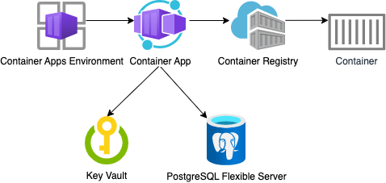

# Flask surveys container app

This repository includes a Flask surveys app that uses [SQLAlchemy](https://www.sqlalchemy.org/)
(via [Flask-SQLAlchemy](https://flask-sqlalchemy.palletsprojects.com/en/3.0.x/)
and [Flask-Migrate](https://flask-migrate.readthedocs.io/en/latest/index.html))
to interact with a PostgreSQL database.


The app is organized using [Flask Blueprints](https://flask.palletsprojects.com/en/2.2.x/blueprints/),
tested with [pytest](https://docs.pytest.org/en/7.2.x/),
linted with [ruff](https://github.com/charliermarsh/ruff), and formatted with [black](https://black.readthedocs.io/en/stable/).
Code quality issues are all checked with both [pre-commit](https://pre-commit.com/) and Github actions.

The repository is designed for use with [Docker containers](https://www.docker.com/), both for local development and deployment, and includes infrastructure files for deployment to [Azure Container Apps](https://learn.microsoft.com/azure/container-apps/overview). 🐳

## Opening the project

This project has [Dev Container support](https://code.visualstudio.com/docs/devcontainers/containers), so it will be be setup automatically if you open it in Github Codespaces or in local VS Code with the [Dev Containers extension](https://marketplace.visualstudio.com/items?itemName=ms-vscode-remote.remote-containers).

If you're not using one of those options for opening the project, then you'll need to:

1. Create a [Python virtual environment](https://docs.python.org/3/tutorial/venv.html#creating-virtual-environments) and activate it.

2. Install requirements:

    ```shell
    python3 -m pip install --user -r requirements-dev.txt
    ```

3. Install the pre-commit hooks:

    ```shell
    pre-commit install
    ```

## Local development with Docker

Since this app depends on a database, there's a `docker-compose.yaml` file that creates two containers
(one for the app, one for the DB) as well as a volume to store the database data.

1. Install [Docker Desktop](https://www.docker.com/products/docker-desktop/). If you opened this inside Github Codespaces or a Dev Container in VS Code, installation is not needed. ⚠️ If you're on an Apple M1/M2, you won't be able to run `docker` commands inside a Dev Container; either use Codespaces or do not open the Dev Container.

2. Create an `.env` file by copying `.env.example`.

3. Start the services with this command:

    ```shell
    docker-compose up --build
    ```

4. Try creating a new survey and answering your newly created survey. 📋 🎉

## Deployment

This repo is set up for deployment on [Azure Container Apps](https://learn.microsoft.com/azure/container-apps/overview) with a [PostGreSQL server](https://learn.microsoft.com/azure/postgresql/flexible-server/overview) using the `Dockerfile` and the configuration files in the `infra` folder.



Steps for deployment:

1. Sign up for a [free Azure account](https://azure.microsoft.com/free/) and create a subscription.
2. Install the [Azure Developer CLI](https://learn.microsoft.com/azure/developer/azure-developer-cli/install-azd). (If you opened this repository in a Dev Container, that part will be done for you.)
3. Initialize a new `azd` environment:

    ```shell
    azd init
    ```

    It will prompt you to provide a name (like "flask-app") that will later be used in the name of the deployed resources.
    
3. Provision and deploy all the resources:

    ```shell
    azd up
    ```

    It will prompt you to login, pick a subscription, and provide a location (like "eastus"). Then it will provision the resources in your account and deploy the latest code. If you get an error with deployment, changing the location (like to "centralus") can help, as there are availability constraints for some of the resources.

4. When `azd` has finished deploying, you'll see an endpoint URI in the command output. Visit that URI, and you should see the front page of the app! 🎉

5. When you've made any changes to the app code, you can just run:

    ```shell
    azd deploy
    ```

### CI/CD pipeline

This project includes a Github workflow for deploying the resources to Azure
on every push to main. That workflow requires several Azure-related authentication secrets
to be stored as Github action secrets. To set that up, run:

```shell
azd pipeline config
```

### Costs

These are only provided as an example, as of Feb-2023. The PostgreSQL server has an hourly cost, so if you are not actively using the app, remember to run `azd down` or delete the resource group to avoid unnecessary costs.

- Azure Container App - Consumption tier with 0.5 CPU, 1GiB memory/storage. Pricing is based on resource allocation, and each month allows for a certain amount of free usage. [Pricing](https://azure.microsoft.com/pricing/details/container-apps/)
- Azure Container Registry - Basic tier. $0.167/day, ~$5/month. [Pricing](https://azure.microsoft.com/pricing/details/container-registry/)
- Azure Database for PostgreSQL flexible server - Burstable tier (B1ms). $0.017/hour or ~$12.41/month. [Pricing](https://azure.microsoft.com/pricing/details/postgresql/flexible-server/)
- Key Vault - Standard tier. $0.04/10,000 transactions. Only a few transactions are used on each deploy. [Pricing](https://azure.microsoft.com/pricing/details/key-vault/)

## Getting help

If you're working with this project and running into issues, please post in [Discussions](/discussions).
